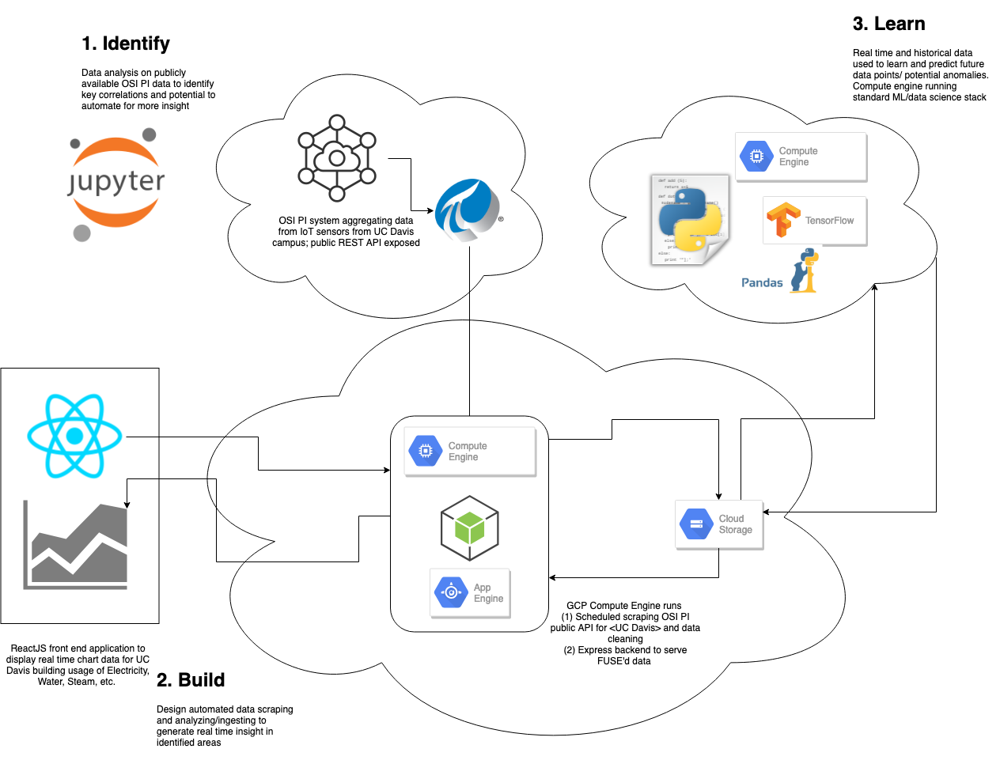

# HackDavis2019

## Overview

Real time data analytics from OSI PI system on UC Davis campus. Anomaly detection etc

1. Data scraped from public OSI PI REST API by scheduled task (cron) on GCP Compute Engine
2. Data cleaned and written to GCS bucket by FUSE
3. Express server on Compute Engine exposes API endpoint for newest clean data
4. ReactJS front end provides insight from data 

