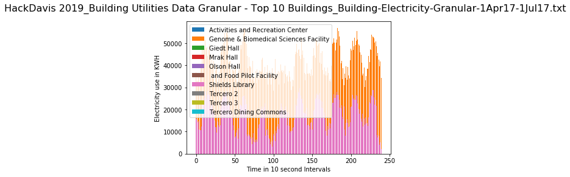
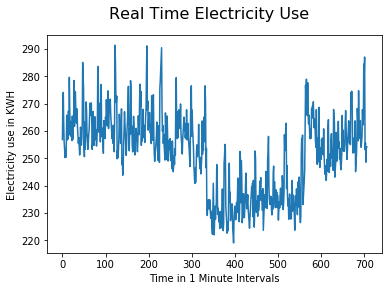
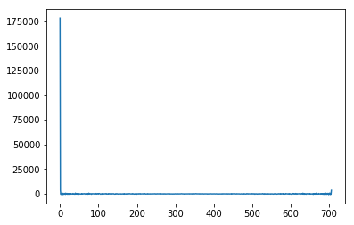
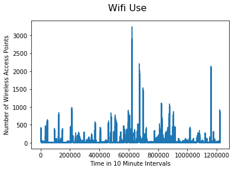
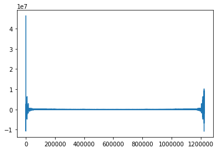

```python
import pandas as pd
import matplotlib.pyplot as plt
import numpy as np 
import requests
import json
```


```python
Weather = 'HackDavis 2019_Weather-1Jan17-7Feb19.txt'
Wifi = 'HackDavis 2019_Wifi Data_Wifi-TotalCount-1Jan19-7Feb19.txt'
ElectrApi = "https://ucd-pi-iis.ou.ad3.ucdavis.edu/piwebapi/streams/A0EbgZy4oKQ9kiBiZJTW7eugwC6-3Qzx_5RGrBZiQlqSuWw2sDVYNIPR1YODsG1RUyETgVVRJTC1BRlxDRUZTXFVDREFWSVNcQlVJTERJTkdTXEFDQURFTUlDIFNVUkdFIEJVSUxESU5HXEVMRUNUUklDSVRZfERFTUFORA/recorded?fbclid=IwAR3HYFcplZeVsxmmHTGAC_ENY0JvoZ_KhnXfPM3tQ2IU3Ef3T3eOv09Q6-k"
ElectrGran = 'HackDavis 2019_Building Utilities Data Granular - Top 10 Buildings_Building-Electricity-Granular-1Apr17-1Jul17.txt'
```


```python
data = pd.read_csv(ElectrGran, sep=",", header=None)
pd.set_option('display.max_columns', 1000)

usage_cols = []

for i in range(0,5):
#     print(11+3*i,data[11+3*i-2][0],sum(data[11+3*i]))
    usage_cols += [11+3*i]

# print("----------------------")
    
for i in range(0,5):
#     print(28+3*i,data[28+3*i-2][0],sum(data[28+3*i]))
    usage_cols += [28+3*i]
```


```python
for i in range(len(usage_cols)):
    col = data[usage_cols[i]]

    day = col[0:8640*10]
    k = int(60*60//10) #do hour increments
    bar = []
    for j in range(int(len(day) // k)):
        bar += [sum(day[j*k:(j+1)*k])]
    
    plt.bar(range(len(bar)),bar, label=data[usage_cols[i] - 2][0])

    
plt.suptitle(ElectrGran, fontsize=16)
plt.legend()
plt.xlabel("Time in 10 second Intervals")
plt.ylabel("Electricity use in KWH")
```


    Text(0, 0.5, 'Electricity use in KWH')





```python
resp = requests.get(url=ElectrApi)
data = resp.json()

arr = data['Items']
timeseries = [(elem['Timestamp'], elem['Value']) for elem in arr]
valuesOnly = [elem[1] for elem in timeseries]


plt.suptitle("Real Time Electricity Use", fontsize=16)
plt.plot(valuesOnly) 
plt.xlabel("Time in 1 Minute Intervals")
plt.ylabel("Electricity use in KWH")
```


    Text(0, 0.5, 'Electricity use in KWH')





```python
frequency_electr = np.fft.fft(valuesOnly)
```


```python
plt.plot(frequency_electr)
```


    [<matplotlib.lines.Line2D at 0x121a014a8>]





```python
wifi = pd.read_csv(Wifi, sep=",", header=None)
```


```python
access_points = wifi[wifi.shape[1]-3]
# access_points = access_points[-2000:]

plt.suptitle("Wifi Use", fontsize=16)
plt.xlabel("Time in 10 Minute Intervals")
plt.ylabel("Number of Wireless Access Points")

plt.plot(access_points)
```


    [<matplotlib.lines.Line2D at 0x122293f60>]





```python
weather = pd.read_csv(Weather, sep=",", header=None)
```


```python
# print(access_points)
frequency = np.fft.fft(access_points)
print(frequency)
plt.plot(frequency)
```

    [ 46375280.        +2.67152950e-12j -10765129.9874196 +3.69808842e+06j
       9321742.2817227 -3.66882977e+06j ...  -3114314.50558819-1.18590698e+05j
       9321742.2817227 +3.66882977e+06j -10765129.9874196 -3.69808842e+06j]


    /Users/raymondfeng/anaconda3/lib/python3.7/site-packages/numpy/core/numeric.py:501: ComplexWarning: Casting complex values to real discards the imaginary part
      return array(a, dtype, copy=False, order=order)


    [<matplotlib.lines.Line2D at 0x1218e5c18>]





```python

```
