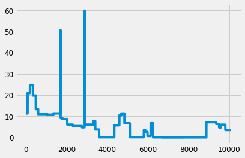
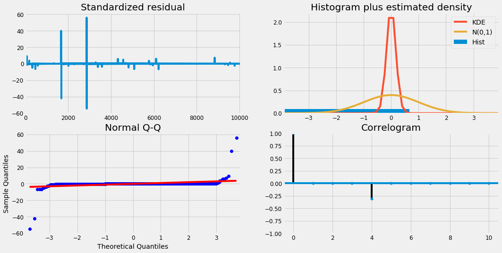
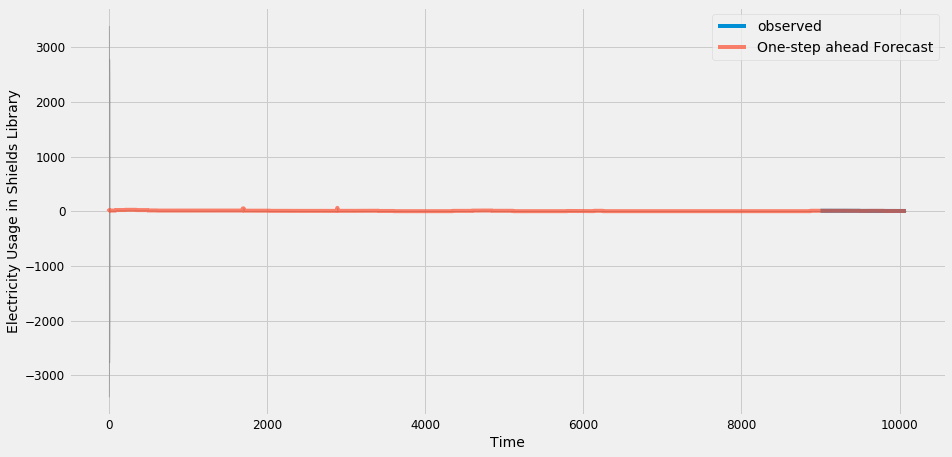
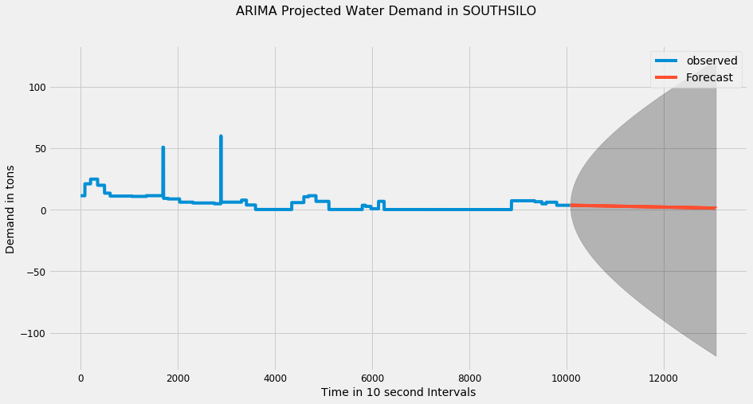

```python
import warnings
import itertools
import numpy as np
import matplotlib.pyplot as plt
warnings.filterwarnings("ignore")
plt.style.use('fivethirtyeight')
import pandas as pd
import statsmodels.api as sm
import matplotlib
import json
import dateutil.parser as parser
from datetime import datetime

matplotlib.rcParams['axes.labelsize'] = 14
matplotlib.rcParams['xtick.labelsize'] = 12
matplotlib.rcParams['ytick.labelsize'] = 12
matplotlib.rcParams['text.color'] = 'k'

WaterRealTime = 'Activities and Recreation Center_ChilledWater_Demand.json'
Water17 = 'HackDavis 2019_Building Utilities 1h_Building-ChilledWater-1Jan17-1Sep17.txt'
Water18 = 'HackDavis 2019_Building Utilities 1h_Building-ChilledWater-1Jan18-1Sep18.txt'
Weather = 'HackDavis 2019_Weather-1Jan17-7Feb19.txt'
Wifi = 'HackDavis 2019_Wifi Data_Wifi-TotalCount-1Jan19-7Feb19.txt'
ElectrApi = "https://ucd-pi-iis.ou.ad3.ucdavis.edu/piwebapi/streams/A0EbgZy4oKQ9kiBiZJTW7eugwC6-3Qzx_5RGrBZiQlqSuWw2sDVYNIPR1YODsG1RUyETgVVRJTC1BRlxDRUZTXFVDREFWSVNcQlVJTERJTkdTXEFDQURFTUlDIFNVUkdFIEJVSUxESU5HXEVMRUNUUklDSVRZfERFTUFORA/recorded?fbclid=IwAR3HYFcplZeVsxmmHTGAC_ENY0JvoZ_KhnXfPM3tQ2IU3Ef3T3eOv09Q6-k"
ElectrGran = 'HackDavis 2019_Building Utilities Data Granular - Top 10 Buildings_Building-Electricity-Granular-1Apr17-1Jul17.txt'
```


```python
times = None

def get_xy_df(pat):
    
    global times

    with open(pat) as f:
        data = json.load(f)

    print("dataframe data")
    d = pd.DataFrame.from_dict(data)
    times =  [x['x'] for x in d.loc[:, 'Points']]
    d['x'] = pd.Series([parser.parse(x['x']).timestamp() for x in d.loc[:, 'Points']])
    d['y'] = pd.Series([x['y'] for x in d.loc[:, 'Points']])
    d = d.loc[:, ['y']]

    return d

df = get_xy_df(WaterRealTime)
plt.plot(df)

lastTime = times[-1]
lastTime = parser.parse(lastTime).timestamp()
```

    dataframe data





```python
df['y'] = pd.to_numeric(df['y'])
print(sum(df['y']))

k = 1 #do day increments
hour_demand = []
for j in range(int(len(df) // k)):
    hour_demand += [sum(df['y'][j*k:(j+1)*k])]

hour_demand = pd.DataFrame({"observed": hour_demand})
plt.plot(hour_demand)
```

    51256.58938430622


    [<matplotlib.lines.Line2D at 0x1c210542e8>]


```python
p = d = q = range(0, 2)
pdq = list(itertools.product(p, d, q))
seasonal_pdq = [(x[0], x[1], x[2], 12) for x in list(itertools.product(p, d, q))]
print('Examples of parameter combinations for Seasonal ARIMA...')
print('SARIMAX: {} x {}'.format(pdq[1], seasonal_pdq[1]))
print('SARIMAX: {} x {}'.format(pdq[1], seasonal_pdq[2]))
print('SARIMAX: {} x {}'.format(pdq[2], seasonal_pdq[3]))
print('SARIMAX: {} x {}'.format(pdq[2], seasonal_pdq[4]))
```

    Examples of parameter combinations for Seasonal ARIMA...
    SARIMAX: (0, 0, 1) x (0, 0, 1, 12)
    SARIMAX: (0, 0, 1) x (0, 1, 0, 12)
    SARIMAX: (0, 1, 0) x (0, 1, 1, 12)
    SARIMAX: (0, 1, 0) x (1, 0, 0, 12)


```python
for param in pdq:
    for param_seasonal in seasonal_pdq:
        try:
            mod = sm.tsa.statespace.SARIMAX(hour_demand,
                                            order=param,
                                            seasonal_order=param_seasonal,
                                            enforce_stationarity=False,
                                            enforce_invertibility=False)
            
            results = mod.fit()
            print('ARIMA{}x{}12 - AIC:{}'.format(param, param_seasonal, results.aic))
        except:
            continue
```

    ARIMA(0, 0, 0)x(0, 0, 0, 12)12 - AIC:69659.25444574116
    ARIMA(0, 0, 0)x(0, 0, 1, 12)12 - AIC:61136.20449878361
    ARIMA(0, 0, 0)x(0, 1, 0, 12)12 - AIC:47945.10145254311
    ARIMA(0, 0, 0)x(0, 1, 1, 12)12 - AIC:44648.703686472676
    ARIMA(0, 0, 0)x(1, 0, 0, 12)12 - AIC:47640.817466153516
    ARIMA(0, 0, 0)x(1, 0, 1, 12)12 - AIC:44651.09105519884
    ARIMA(0, 0, 0)x(1, 1, 0, 12)12 - AIC:45824.11013130605
    ARIMA(0, 0, 0)x(1, 1, 1, 12)12 - AIC:44642.90029850837
    ARIMA(0, 0, 1)x(0, 0, 0, 12)12 - AIC:57140.56493777654
    ARIMA(0, 0, 1)x(0, 0, 1, 12)12 - AIC:49446.55088072245
    ARIMA(0, 0, 1)x(0, 1, 0, 12)12 - AIC:39391.83311430432
    ARIMA(0, 0, 1)x(0, 1, 1, 12)12 - AIC:36010.29787852411
    ARIMA(0, 0, 1)x(1, 0, 0, 12)12 - AIC:38970.149452194644
    ARIMA(0, 0, 1)x(1, 0, 1, 12)12 - AIC:36000.452680640956
    ARIMA(0, 0, 1)x(1, 1, 0, 12)12 - AIC:37421.84574454921
    ARIMA(0, 0, 1)x(1, 1, 1, 12)12 - AIC:35967.84230229586
    ARIMA(0, 1, 0)x(0, 0, 0, 12)12 - AIC:28215.51239681983
    ARIMA(0, 1, 0)x(0, 0, 1, 12)12 - AIC:28195.914403528037
    ARIMA(0, 1, 0)x(0, 1, 0, 12)12 - AIC:35171.827069577055
    ARIMA(0, 1, 0)x(0, 1, 1, 12)12 - AIC:28235.428630839328
    ARIMA(0, 1, 0)x(1, 0, 0, 12)12 - AIC:28197.714781617324
    ARIMA(0, 1, 0)x(1, 0, 1, 12)12 - AIC:28197.916255688426
    ARIMA(0, 1, 0)x(1, 1, 0, 12)12 - AIC:32253.460803701135
    ARIMA(0, 1, 0)x(1, 1, 1, 12)12 - AIC:28237.43020366768
    ARIMA(0, 1, 1)x(0, 0, 0, 12)12 - AIC:28215.71311036516
    ARIMA(0, 1, 1)x(0, 0, 1, 12)12 - AIC:28196.113928874587
    ARIMA(0, 1, 1)x(0, 1, 0, 12)12 - AIC:35098.877649735135
    ARIMA(0, 1, 1)x(0, 1, 1, 12)12 - AIC:28235.626548449913
    ARIMA(0, 1, 1)x(1, 0, 0, 12)12 - AIC:28199.714782329247
    ARIMA(0, 1, 1)x(1, 0, 1, 12)12 - AIC:28198.115773302867
    ARIMA(0, 1, 1)x(1, 1, 0, 12)12 - AIC:32247.451470284697
    ARIMA(0, 1, 1)x(1, 1, 1, 12)12 - AIC:28237.6265955133
    ARIMA(1, 0, 0)x(0, 0, 0, 12)12 - AIC:28176.940110944743
    ARIMA(1, 0, 0)x(0, 0, 1, 12)12 - AIC:28157.130667383797
    ARIMA(1, 0, 0)x(0, 1, 0, 12)12 - AIC:34442.250515317326
    ARIMA(1, 0, 0)x(0, 1, 1, 12)12 - AIC:28110.917756660863
    ARIMA(1, 0, 0)x(1, 0, 0, 12)12 - AIC:28157.128397671528
    ARIMA(1, 0, 0)x(1, 0, 1, 12)12 - AIC:28159.122179195103
    ARIMA(1, 0, 0)x(1, 1, 0, 12)12 - AIC:31584.714009998894
    ARIMA(1, 0, 0)x(1, 1, 1, 12)12 - AIC:28112.91698900801
    ARIMA(1, 0, 1)x(0, 0, 0, 12)12 - AIC:28176.967050208554
    ARIMA(1, 0, 1)x(0, 0, 1, 12)12 - AIC:28157.086586583773
    ARIMA(1, 0, 1)x(0, 1, 0, 12)12 - AIC:34203.52159163403
    ARIMA(1, 0, 1)x(0, 1, 1, 12)12 - AIC:28106.63602496139
    ARIMA(1, 0, 1)x(1, 0, 0, 12)12 - AIC:28158.88900138704
    ARIMA(1, 0, 1)x(1, 0, 1, 12)12 - AIC:28159.075534684674
    ARIMA(1, 0, 1)x(1, 1, 0, 12)12 - AIC:31499.7716208524
    ARIMA(1, 0, 1)x(1, 1, 1, 12)12 - AIC:28108.633412034083
    ARIMA(1, 1, 0)x(0, 0, 0, 12)12 - AIC:28217.512396299415
    ARIMA(1, 1, 0)x(0, 0, 1, 12)12 - AIC:28197.914404067902
    ARIMA(1, 1, 0)x(0, 1, 0, 12)12 - AIC:35102.2096257574
    ARIMA(1, 1, 0)x(0, 1, 1, 12)12 - AIC:28237.42861008613
    ARIMA(1, 1, 0)x(1, 0, 0, 12)12 - AIC:28197.914403359442
    ARIMA(1, 1, 0)x(1, 0, 1, 12)12 - AIC:28199.916251586445
    ARIMA(1, 1, 0)x(1, 1, 0, 12)12 - AIC:32245.25490913808
    ARIMA(1, 1, 0)x(1, 1, 1, 12)12 - AIC:28239.428661614405
    ARIMA(1, 1, 1)x(0, 0, 0, 12)12 - AIC:28217.713110590048
    ARIMA(1, 1, 1)x(0, 0, 1, 12)12 - AIC:28198.113925392026
    ARIMA(1, 1, 1)x(0, 1, 0, 12)12 - AIC:34447.28638611903
    ARIMA(1, 1, 1)x(0, 1, 1, 12)12 - AIC:28237.62651663675
    ARIMA(1, 1, 1)x(1, 0, 0, 12)12 - AIC:28199.914403546598
    ARIMA(1, 1, 1)x(1, 0, 1, 12)12 - AIC:28200.11577689416
    ARIMA(1, 1, 1)x(1, 1, 0, 12)12 - AIC:31857.15846984454
    ARIMA(1, 1, 1)x(1, 1, 1, 12)12 - AIC:28239.626568080486


```python
mod = sm.tsa.statespace.SARIMAX(hour_demand,
                                order=(1, 1, 1),
                                seasonal_order=(1, 1, 1, 12),
                                enforce_stationarity=False,
                                enforce_invertibility=False)
results = mod.fit()
print(results.summary().tables[1])
```

    ==============================================================================
                     coef    std err          z      P>|z|      [0.025      0.975]
    ------------------------------------------------------------------------------
    ar.L1         -0.0423     38.402     -0.001      0.999     -75.308      75.224
    ma.L1          0.0425     38.392      0.001      0.999     -75.205      75.290
    ar.S.L12   -7.841e-06      0.036     -0.000      1.000      -0.071       0.071
    ma.S.L12      -1.0000      1.041     -0.961      0.337      -3.039       1.039
    sigma2         0.9634      1.004      0.960      0.337      -1.004       2.931
    ==============================================================================


```python
results.plot_diagnostics(figsize=(16, 8))
plt.show()
```





```python
pred = results.get_prediction(start=0, dynamic=False)
pred_ci = pred.conf_int()
ax = hour_demand[9000:].plot(label='observed')
pred.predicted_mean.plot(ax=ax, label='One-step ahead Forecast', alpha=.7, figsize=(14, 7))
ax.fill_between(pred_ci.index,
                pred_ci.iloc[:, 0],
                pred_ci.iloc[:, 1], color='k', alpha=.2)
ax.set_xlabel('Time')
ax.set_ylabel('Electricity Usage in Shields Library')
plt.legend()
plt.show()

plt.suptitle(ElectrGran, fontsize=16)
```





    Text(0.5, 0.98, 'HackDavis 2019_Building Utilities Data Granular - Top 10 Buildings_Building-Electricity-Granular-1Apr17-1Jul17.txt')


    <Figure size 432x288 with 0 Axes>


```python
y_forecasted = pred.predicted_mean
temp = np.array(hour_demand).reshape(len(hour_demand),)
y_truth = temp[:]
mse = ((y_forecasted - y_truth) ** 2).mean()
print('The Mean Squared Error of our forecasts is {}'.format(round(mse, 2)))
```

    The Mean Squared Error of our forecasts is 0.99


```python
print('The Root Mean Squared Error of our forecasts is {}'.format(round(np.sqrt(mse), 2)))
```

    The Root Mean Squared Error of our forecasts is 0.99


```python
pred_uc = results.get_forecast(steps=3000)
pred_ci = pred_uc.conf_int()
ax = hour_demand.plot(label='observed', figsize=(14, 7))
pred_uc.predicted_mean.plot(ax=ax, label='Forecast')
ax.fill_between(pred_ci.index,
                pred_ci.iloc[:, 0],
                pred_ci.iloc[:, 1], color='k', alpha=.25)

plt.legend()
plt.suptitle("ARIMA Projected Water Demand in SOUTHSILO", fontsize=16)
plt.xlabel("Time in 10 second Intervals")
plt.ylabel("Demand in tons")
plt.show()
```





```python
result = []
for i in range(len(pred_uc.predicted_mean)):
    result += [(lastTime + 60*i, pred_uc.predicted_mean.values[i])]
```


```python
times = None

with open(WaterRealTime) as f:
    data = json.load(f)

d = dict(data).copy()

for x,y in result:
    d['Points'].append({'x': datetime.utcfromtimestamp(x).isoformat('T') + 'Z', 'y':y})
```


```python
with open(WaterRealTime + "_Predictions" + str(3000) + ".json", 'w') as fp:
    json.dump(d, fp)
```
