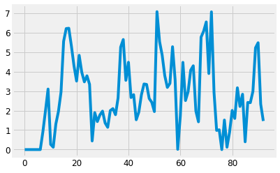
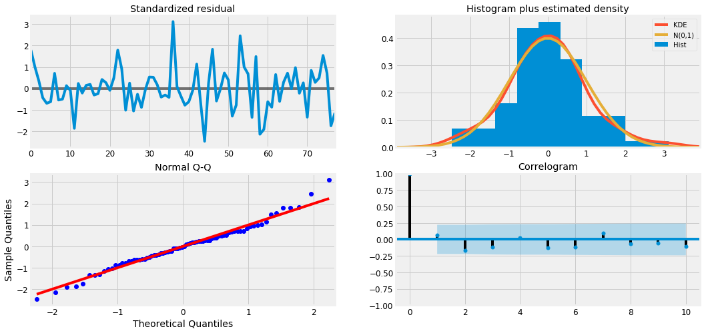
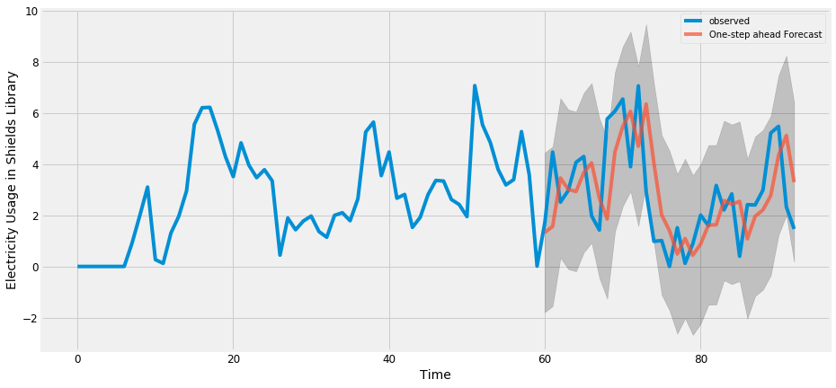
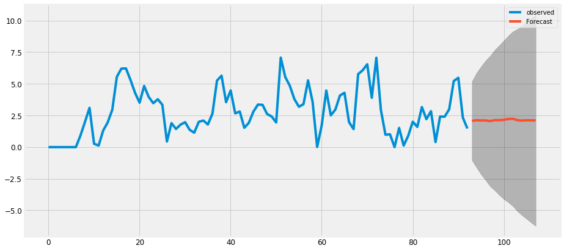

```python
import warnings
import itertools
import numpy as np
import matplotlib.pyplot as plt
warnings.filterwarnings("ignore")
plt.style.use('fivethirtyeight')
import pandas as pd
import statsmodels.api as sm
import matplotlib

import warnings
warnings.simplefilter('ignore')

matplotlib.rcParams['axes.labelsize'] = 14
matplotlib.rcParams['xtick.labelsize'] = 12
matplotlib.rcParams['ytick.labelsize'] = 12
matplotlib.rcParams['text.color'] = 'k'

Water17 = 'HackDavis 2019_Building Utilities 1h_Building-ChilledWater-1Jan17-1Sep17.txt'
Water18 = 'HackDavis 2019_Building Utilities 1h_Building-ChilledWater-1Jan18-1Sep18.txt'
Weather = 'HackDavis 2019_Weather-1Jan17-7Feb19.txt'
Wifi = 'HackDavis 2019_Wifi Data_Wifi-TotalCount-1Jan19-7Feb19.txt'
ElectrApi = "https://ucd-pi-iis.ou.ad3.ucdavis.edu/piwebapi/streams/A0EbgZy4oKQ9kiBiZJTW7eugwC6-3Qzx_5RGrBZiQlqSuWw2sDVYNIPR1YODsG1RUyETgVVRJTC1BRlxDRUZTXFVDREFWSVNcQlVJTERJTkdTXEFDQURFTUlDIFNVUkdFIEJVSUxESU5HXEVMRUNUUklDSVRZfERFTUFORA/recorded?fbclid=IwAR3HYFcplZeVsxmmHTGAC_ENY0JvoZ_KhnXfPM3tQ2IU3Ef3T3eOv09Q6-k"
ElectrGran = 'HackDavis 2019_Building Utilities Data Granular - Top 10 Buildings_Building-Electricity-Granular-1Apr17-1Jul17.txt'
```


```python
# data = pd.read_csv(Water17, sep=",", header=None, error_bad_lines=False)
```


```python
demand = data[17]
silosouth = demand[:5833]
# cafescrubs = demand[5833:11664]
# cafescrubs.index = np.arange(0, len(cafescrubs))

k = 24 #do day increments
day_demand = []
for j in range(int(len(silosouth) // k)):
    day_demand += [sum(silosouth[j*k:(j+1)*k])]

day_demand = day_demand[150:]
plt.plot(day_demand[:])
day_demand = pd.DataFrame({"observed": day_demand})
# plt.plot(cafescrubs)
```





```python
p = d = q = range(0, 2)
pdq = list(itertools.product(p, d, q))
seasonal_pdq = [(x[0], x[1], x[2], 12) for x in list(itertools.product(p, d, q))]
print('Examples of parameter combinations for Seasonal ARIMA...')
print('SARIMAX: {} x {}'.format(pdq[1], seasonal_pdq[1]))
print('SARIMAX: {} x {}'.format(pdq[1], seasonal_pdq[2]))
print('SARIMAX: {} x {}'.format(pdq[2], seasonal_pdq[3]))
print('SARIMAX: {} x {}'.format(pdq[2], seasonal_pdq[4]))
```

    Examples of parameter combinations for Seasonal ARIMA...
    SARIMAX: (0, 0, 1) x (0, 0, 1, 12)
    SARIMAX: (0, 0, 1) x (0, 1, 0, 12)
    SARIMAX: (0, 1, 0) x (0, 1, 1, 12)
    SARIMAX: (0, 1, 0) x (1, 0, 0, 12)


```python
for param in pdq:
    for param_seasonal in seasonal_pdq:
        try:
            mod = sm.tsa.statespace.SARIMAX(silosouth,
                                            order=param,
                                            seasonal_order=param_seasonal,
                                            enforce_stationarity=False,
                                            enforce_invertibility=False)
            
            results = mod.fit()
            print('ARIMA{}x{}12 - AIC:{}'.format(param, param_seasonal, results.aic))
        except:
            continue
```

    /Users/raymondfeng/anaconda3/lib/python3.7/site-packages/statsmodels/base/model.py:508: ConvergenceWarning: Maximum Likelihood optimization failed to converge. Check mle_retvals
      "Check mle_retvals", ConvergenceWarning)


    ARIMA(0, 0, 0)x(0, 0, 0, 12)12 - AIC:-10148.66447080645
    ARIMA(0, 0, 0)x(0, 0, 1, 12)12 - AIC:-10935.204160982501
    ARIMA(0, 0, 0)x(0, 1, 0, 12)12 - AIC:-10570.584202450471
    ARIMA(0, 0, 0)x(0, 1, 1, 12)12 - AIC:-14539.083730507708
    ARIMA(0, 0, 0)x(1, 0, 0, 12)12 - AIC:-12099.609315226384
    ARIMA(0, 0, 0)x(1, 0, 1, 12)12 - AIC:-14598.572600165371


    /Users/raymondfeng/anaconda3/lib/python3.7/site-packages/statsmodels/base/model.py:508: ConvergenceWarning: Maximum Likelihood optimization failed to converge. Check mle_retvals
      "Check mle_retvals", ConvergenceWarning)


    ARIMA(0, 0, 0)x(1, 1, 0, 12)12 - AIC:-14948.176732953558
    ARIMA(0, 0, 0)x(1, 1, 1, 12)12 - AIC:-15154.139371756259
    ARIMA(0, 0, 1)x(0, 0, 0, 12)12 - AIC:-17586.816733754822
    ARIMA(0, 0, 1)x(0, 0, 1, 12)12 - AIC:-18356.392988951055
    ARIMA(0, 0, 1)x(0, 1, 0, 12)12 - AIC:-18100.046126847563
    ARIMA(0, 0, 1)x(0, 1, 1, 12)12 - AIC:-21633.7969382364
    ARIMA(0, 0, 1)x(1, 0, 0, 12)12 - AIC:-19501.748691973502
    ARIMA(0, 0, 1)x(1, 0, 1, 12)12 - AIC:-21710.534507958804
    ARIMA(0, 0, 1)x(1, 1, 0, 12)12 - AIC:-21888.15674296746
    ARIMA(0, 0, 1)x(1, 1, 1, 12)12 - AIC:-22081.608765087232
    ARIMA(0, 1, 0)x(0, 0, 0, 12)12 - AIC:-30863.53887211453
    ARIMA(0, 1, 0)x(0, 0, 1, 12)12 - AIC:-31076.803689743123
    ARIMA(0, 1, 0)x(0, 1, 0, 12)12 - AIC:-25338.141355340238
    ARIMA(0, 1, 0)x(0, 1, 1, 12)12 - AIC:-30739.037348317157
    ARIMA(0, 1, 0)x(1, 0, 0, 12)12 - AIC:-31259.964122270496
    ARIMA(0, 1, 0)x(1, 0, 1, 12)12 - AIC:-32327.376483467342
    ARIMA(0, 1, 0)x(1, 1, 0, 12)12 - AIC:-29900.0647031316
    ARIMA(0, 1, 0)x(1, 1, 1, 12)12 - AIC:-31461.41226597497
    ARIMA(0, 1, 1)x(0, 0, 0, 12)12 - AIC:-33213.68977773776
    ARIMA(0, 1, 1)x(0, 0, 1, 12)12 - AIC:-33261.793884845276
    ARIMA(0, 1, 1)x(0, 1, 0, 12)12 - AIC:-28172.198998726697
    ARIMA(0, 1, 1)x(0, 1, 1, 12)12 - AIC:-33054.698981818314
    ARIMA(0, 1, 1)x(1, 0, 0, 12)12 - AIC:-33338.91337560165
    ARIMA(0, 1, 1)x(1, 0, 1, 12)12 - AIC:-34053.417358380604
    ARIMA(0, 1, 1)x(1, 1, 0, 12)12 - AIC:-31783.451319989003
    ARIMA(0, 1, 1)x(1, 1, 1, 12)12 - AIC:-33314.14638818322
    ARIMA(1, 0, 0)x(0, 0, 0, 12)12 - AIC:-30909.73739744594
    ARIMA(1, 0, 0)x(0, 0, 1, 12)12 - AIC:-31112.080568742924


    /Users/raymondfeng/anaconda3/lib/python3.7/site-packages/statsmodels/base/model.py:508: ConvergenceWarning: Maximum Likelihood optimization failed to converge. Check mle_retvals
      "Check mle_retvals", ConvergenceWarning)


    ARIMA(1, 0, 0)x(0, 1, 0, 12)12 - AIC:-25456.058191288677
    ARIMA(1, 0, 0)x(0, 1, 1, 12)12 - AIC:-30814.048964966085
    ARIMA(1, 0, 0)x(1, 0, 0, 12)12 - AIC:-31285.932084751417
    ARIMA(1, 0, 0)x(1, 0, 1, 12)12 - AIC:-32364.395244573974
    ARIMA(1, 0, 0)x(1, 1, 0, 12)12 - AIC:-28938.380661939736
    ARIMA(1, 0, 0)x(1, 1, 1, 12)12 - AIC:-28970.062076671507
    ARIMA(1, 0, 1)x(0, 0, 0, 12)12 - AIC:-33283.042031617035
    ARIMA(1, 0, 1)x(0, 0, 1, 12)12 - AIC:-33319.5944207791
    ARIMA(1, 0, 1)x(0, 1, 0, 12)12 - AIC:-28345.533607477235
    ARIMA(1, 0, 1)x(0, 1, 1, 12)12 - AIC:-33167.25093780634
    ARIMA(1, 0, 1)x(1, 0, 0, 12)12 - AIC:-33386.869894810035
    ARIMA(1, 0, 1)x(1, 0, 1, 12)12 - AIC:-33219.585343795006
    ARIMA(1, 0, 1)x(1, 1, 0, 12)12 - AIC:-31954.463129499756


    /Users/raymondfeng/anaconda3/lib/python3.7/site-packages/statsmodels/base/model.py:508: ConvergenceWarning: Maximum Likelihood optimization failed to converge. Check mle_retvals
      "Check mle_retvals", ConvergenceWarning)


    ARIMA(1, 0, 1)x(1, 1, 1, 12)12 - AIC:-33433.88176947386
    ARIMA(1, 1, 0)x(0, 0, 0, 12)12 - AIC:-34546.79932574704
    ARIMA(1, 1, 0)x(0, 0, 1, 12)12 - AIC:-34467.592373987


    /Users/raymondfeng/anaconda3/lib/python3.7/site-packages/statsmodels/base/model.py:508: ConvergenceWarning: Maximum Likelihood optimization failed to converge. Check mle_retvals
      "Check mle_retvals", ConvergenceWarning)


    ARIMA(1, 1, 0)x(0, 1, 0, 12)12 - AIC:-30312.187145199372
    ARIMA(1, 1, 0)x(0, 1, 1, 12)12 - AIC:-34378.88369352227


    /Users/raymondfeng/anaconda3/lib/python3.7/site-packages/statsmodels/base/model.py:508: ConvergenceWarning: Maximum Likelihood optimization failed to converge. Check mle_retvals
      "Check mle_retvals", ConvergenceWarning)


    ARIMA(1, 1, 0)x(1, 0, 0, 12)12 - AIC:-34469.97920888491
    ARIMA(1, 1, 0)x(1, 0, 1, 12)12 - AIC:-34807.68271643708


    /Users/raymondfeng/anaconda3/lib/python3.7/site-packages/statsmodels/base/model.py:508: ConvergenceWarning: Maximum Likelihood optimization failed to converge. Check mle_retvals
      "Check mle_retvals", ConvergenceWarning)


    ARIMA(1, 1, 0)x(1, 1, 0, 12)12 - AIC:-32847.68654014396
    ARIMA(1, 1, 0)x(1, 1, 1, 12)12 - AIC:-34389.090550514375
    ARIMA(1, 1, 1)x(0, 0, 0, 12)12 - AIC:-34557.42038900633
    ARIMA(1, 1, 1)x(0, 0, 1, 12)12 - AIC:-34476.31616515122


    /Users/raymondfeng/anaconda3/lib/python3.7/site-packages/statsmodels/base/model.py:508: ConvergenceWarning: Maximum Likelihood optimization failed to converge. Check mle_retvals
      "Check mle_retvals", ConvergenceWarning)


    ARIMA(1, 1, 1)x(0, 1, 0, 12)12 - AIC:-30370.974906233663
    ARIMA(1, 1, 1)x(0, 1, 1, 12)12 - AIC:-34397.66217006778
    ARIMA(1, 1, 1)x(1, 0, 0, 12)12 - AIC:-34484.868472465714


    /Users/raymondfeng/anaconda3/lib/python3.7/site-packages/statsmodels/base/model.py:508: ConvergenceWarning: Maximum Likelihood optimization failed to converge. Check mle_retvals
      "Check mle_retvals", ConvergenceWarning)


    ARIMA(1, 1, 1)x(1, 0, 1, 12)12 - AIC:-34546.916551924674
    ARIMA(1, 1, 1)x(1, 1, 0, 12)12 - AIC:-32906.77512376265


    /Users/raymondfeng/anaconda3/lib/python3.7/site-packages/statsmodels/base/model.py:508: ConvergenceWarning: Maximum Likelihood optimization failed to converge. Check mle_retvals
      "Check mle_retvals", ConvergenceWarning)


    ARIMA(1, 1, 1)x(1, 1, 1, 12)12 - AIC:-34403.88004695339


```python
mod = sm.tsa.statespace.SARIMAX(day_demand,
                                order=(0, 1, 1),
                                seasonal_order=(1, 0, 1, 12),
                                enforce_stationarity=False,
                                enforce_invertibility=False)
results = mod.fit()
print(results.summary().tables[1])
```

    ==============================================================================
                     coef    std err          z      P>|z|      [0.025      0.975]
    ------------------------------------------------------------------------------
    ma.L1         -0.3420      0.124     -2.762      0.006      -0.585      -0.099
    ar.S.L12      -0.1426      0.573     -0.249      0.803      -1.265       0.979
    ma.S.L12       0.1753      0.579      0.303      0.762      -0.959       1.310
    sigma2         2.5324      0.388      6.526      0.000       1.772       3.293
    ==============================================================================


```python
results.plot_diagnostics(figsize=(16, 8))
plt.show()
```





```python
pred = results.get_prediction(start=60, dynamic=False)
pred_ci = pred.conf_int()
ax = day_demand[0:].plot(label='observed')
pred.predicted_mean.plot(ax=ax, label='One-step ahead Forecast', alpha=.7, figsize=(14, 7))
ax.fill_between(pred_ci.index,
                pred_ci.iloc[:, 0],
                pred_ci.iloc[:, 1], color='k', alpha=.2)
ax.set_xlabel('Time')
ax.set_ylabel('Electricity Usage in Shields Library')
plt.legend()
plt.show()

plt.suptitle(ElectrGran, fontsize=16)
```





    Text(0.5, 0.98, 'HackDavis 2019_Building Utilities Data Granular - Top 10 Buildings_Building-Electricity-Granular-1Apr17-1Jul17.txt')


    <Figure size 432x288 with 0 Axes>


```python
y_forecasted = pred.predicted_mean
hoe = np.array(day_demand).reshape(93,)
y_truth = hoe[60:]
mse = ((y_forecasted - y_truth) ** 2).mean()
print('The Mean Squared Error of our forecasts is {}'.format(round(mse, 2)))
```

    The Mean Squared Error of our forecasts is 3.09


```python
print('The Root Mean Squared Error of our forecasts is {}'.format(round(np.sqrt(mse), 2)))
```

    The Root Mean Squared Error of our forecasts is 1.76


```python
pred_uc = results.get_forecast(steps=15)
pred_ci = pred_uc.conf_int()
ax = day_demand.plot(label='observed', figsize=(14, 7))
pred_uc.predicted_mean.plot(ax=ax, label='Forecast')
ax.fill_between(pred_ci.index,
                pred_ci.iloc[:, 0],
                pred_ci.iloc[:, 1], color='k', alpha=.25)
# ax.set_xlabel('Date')
# ax.set_ylabel('Furniture Sales')
plt.legend()
plt.show()
```





```python

```
