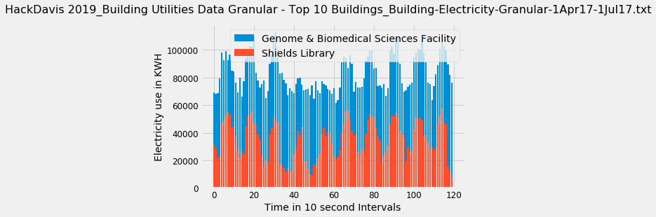
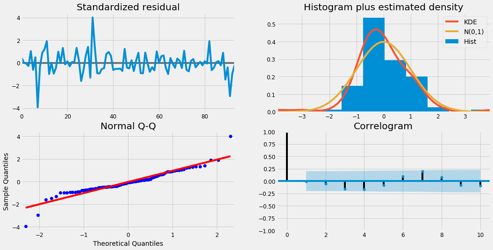
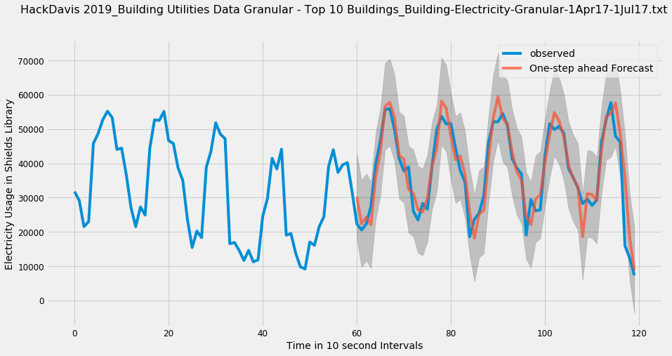
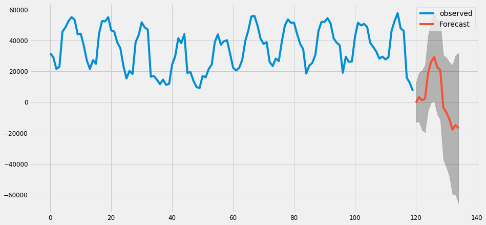

```python
import warnings
import itertools
import numpy as np
import matplotlib.pyplot as plt
warnings.filterwarnings("ignore")
plt.style.use('fivethirtyeight')
import pandas as pd
import statsmodels.api as sm
import matplotlib
matplotlib.rcParams['axes.labelsize'] = 14
matplotlib.rcParams['xtick.labelsize'] = 12
matplotlib.rcParams['ytick.labelsize'] = 12
matplotlib.rcParams['text.color'] = 'k'

Weather = 'HackDavis 2019_Weather-1Jan17-7Feb19.txt'
Wifi = 'HackDavis 2019_Wifi Data_Wifi-TotalCount-1Jan19-7Feb19.txt'
ElectrApi = "https://ucd-pi-iis.ou.ad3.ucdavis.edu/piwebapi/streams/A0EbgZy4oKQ9kiBiZJTW7eugwC6-3Qzx_5RGrBZiQlqSuWw2sDVYNIPR1YODsG1RUyETgVVRJTC1BRlxDRUZTXFVDREFWSVNcQlVJTERJTkdTXEFDQURFTUlDIFNVUkdFIEJVSUxESU5HXEVMRUNUUklDSVRZfERFTUFORA/recorded?fbclid=IwAR3HYFcplZeVsxmmHTGAC_ENY0JvoZ_KhnXfPM3tQ2IU3Ef3T3eOv09Q6-k"
ElectrGran = 'HackDavis 2019_Building Utilities Data Granular - Top 10 Buildings_Building-Electricity-Granular-1Apr17-1Jul17.txt'
```


```python
data = pd.read_csv(ElectrGran, sep=",", header=None)
```


```python
usage_cols = [31,14]
bar = []
for i in reversed(range(len(usage_cols))):
    col = data[usage_cols[i]]

    day = col[0:8640*10]
    k = int(2*60*60//10) #do hour increments
    bar = []
    for j in range(int(len(day) // k)):
        bar += [sum(day[j*k:(j+1)*k])]
    
    plt.bar(range(len(bar)),bar, label=data[usage_cols[i] - 2][0])


bar = pd.DataFrame({'observed':bar})
plt.suptitle(ElectrGran, fontsize=16)
plt.legend()
plt.xlabel("Time in 10 second Intervals")
plt.ylabel("Electricity use in KWH")
```


    Text(0, 0.5, 'Electricity use in KWH')





```python
p = d = q = range(0, 2)
pdq = list(itertools.product(p, d, q))
seasonal_pdq = [(x[0], x[1], x[2], 12) for x in list(itertools.product(p, d, q))]
print('Examples of parameter combinations for Seasonal ARIMA...')
print('SARIMAX: {} x {}'.format(pdq[1], seasonal_pdq[1]))
print('SARIMAX: {} x {}'.format(pdq[1], seasonal_pdq[2]))
print('SARIMAX: {} x {}'.format(pdq[2], seasonal_pdq[3]))
print('SARIMAX: {} x {}'.format(pdq[2], seasonal_pdq[4]))
```

    Examples of parameter combinations for Seasonal ARIMA...
    SARIMAX: (0, 0, 1) x (0, 0, 1, 12)
    SARIMAX: (0, 0, 1) x (0, 1, 0, 12)
    SARIMAX: (0, 1, 0) x (0, 1, 1, 12)
    SARIMAX: (0, 1, 0) x (1, 0, 0, 12)


```python
for param in pdq:
    for param_seasonal in seasonal_pdq:
        try:
            mod = sm.tsa.statespace.SARIMAX(bar,
                                            order=param,
                                            seasonal_order=param_seasonal,
                                            enforce_stationarity=False,
                                            enforce_invertibility=False)
            
            results = mod.fit()
            print('ARIMA{}x{}12 - AIC:{}'.format(param, param_seasonal, results.aic))
        except:
            continue
```

    ARIMA(0, 0, 0)x(0, 0, 0, 12)12 - AIC:2845.414316265852
    ARIMA(0, 0, 0)x(0, 0, 1, 12)12 - AIC:2483.3533713690977
    ARIMA(0, 0, 0)x(0, 1, 0, 12)12 - AIC:2254.6487176547657
    ARIMA(0, 0, 0)x(0, 1, 1, 12)12 - AIC:2002.6663159087618
    ARIMA(0, 0, 0)x(1, 0, 0, 12)12 - AIC:2273.1296920738496
    ARIMA(0, 0, 0)x(1, 0, 1, 12)12 - AIC:2253.903599974713
    ARIMA(0, 0, 0)x(1, 1, 0, 12)12 - AIC:2032.7106968752169
    ARIMA(0, 0, 0)x(1, 1, 1, 12)12 - AIC:1999.55821318482
    ARIMA(0, 0, 1)x(0, 0, 0, 12)12 - AIC:2741.8293538945463
    ARIMA(0, 0, 1)x(0, 0, 1, 12)12 - AIC:2442.1736426909506
    ARIMA(0, 0, 1)x(0, 1, 0, 12)12 - AIC:2198.2902075785673
    ARIMA(0, 0, 1)x(0, 1, 1, 12)12 - AIC:1947.9198675830316
    ARIMA(0, 0, 1)x(1, 0, 0, 12)12 - AIC:2477.07183323941
    ARIMA(0, 0, 1)x(1, 0, 1, 12)12 - AIC:2433.257273045463
    ARIMA(0, 0, 1)x(1, 1, 0, 12)12 - AIC:1998.185282095194
    ARIMA(0, 0, 1)x(1, 1, 1, 12)12 - AIC:1947.866363795865
    ARIMA(0, 1, 0)x(0, 0, 0, 12)12 - AIC:2477.3409890928674
    ARIMA(0, 1, 0)x(0, 0, 1, 12)12 - AIC:2187.1158292939217
    ARIMA(0, 1, 0)x(0, 1, 0, 12)12 - AIC:2175.2192447972106
    ARIMA(0, 1, 0)x(0, 1, 1, 12)12 - AIC:1911.8082154986512
    ARIMA(0, 1, 0)x(1, 0, 0, 12)12 - AIC:2181.947826154528
    ARIMA(0, 1, 0)x(1, 0, 1, 12)12 - AIC:2162.54535701177
    ARIMA(0, 1, 0)x(1, 1, 0, 12)12 - AIC:1944.906148036441
    ARIMA(0, 1, 0)x(1, 1, 1, 12)12 - AIC:1913.0831303542166
    ARIMA(0, 1, 1)x(0, 0, 0, 12)12 - AIC:2455.815219876187
    ARIMA(0, 1, 1)x(0, 0, 1, 12)12 - AIC:2169.5578079273914
    ARIMA(0, 1, 1)x(0, 1, 0, 12)12 - AIC:2142.941180599457
    ARIMA(0, 1, 1)x(0, 1, 1, 12)12 - AIC:1888.7526120972902
    ARIMA(0, 1, 1)x(1, 0, 0, 12)12 - AIC:2179.2558344714944
    ARIMA(0, 1, 1)x(1, 0, 1, 12)12 - AIC:2152.6446140929497
    ARIMA(0, 1, 1)x(1, 1, 0, 12)12 - AIC:1940.4124726406433
    ARIMA(0, 1, 1)x(1, 1, 1, 12)12 - AIC:1890.2267181794934
    ARIMA(1, 0, 0)x(0, 0, 0, 12)12 - AIC:2497.427902450703
    ARIMA(1, 0, 0)x(0, 0, 1, 12)12 - AIC:2210.7506659736646
    ARIMA(1, 0, 0)x(0, 1, 0, 12)12 - AIC:2183.481565452521
    ARIMA(1, 0, 0)x(0, 1, 1, 12)12 - AIC:1928.2102281259592
    ARIMA(1, 0, 0)x(1, 0, 0, 12)12 - AIC:2195.9589262390236
    ARIMA(1, 0, 0)x(1, 0, 1, 12)12 - AIC:2196.6060663171816
    ARIMA(1, 0, 0)x(1, 1, 0, 12)12 - AIC:1938.693661462713
    ARIMA(1, 0, 0)x(1, 1, 1, 12)12 - AIC:1929.8122713196997
    ARIMA(1, 0, 1)x(0, 0, 0, 12)12 - AIC:2476.075661465873
    ARIMA(1, 0, 1)x(0, 0, 1, 12)12 - AIC:2192.436917034296
    ARIMA(1, 0, 1)x(0, 1, 0, 12)12 - AIC:2161.3935449805017
    ARIMA(1, 0, 1)x(0, 1, 1, 12)12 - AIC:1908.310769129494
    ARIMA(1, 0, 1)x(1, 0, 0, 12)12 - AIC:2196.575451530024
    ARIMA(1, 0, 1)x(1, 0, 1, 12)12 - AIC:2176.3615586024885
    ARIMA(1, 0, 1)x(1, 1, 0, 12)12 - AIC:1938.624347495945
    ARIMA(1, 0, 1)x(1, 1, 1, 12)12 - AIC:1909.9589706039922
    ARIMA(1, 1, 0)x(0, 0, 0, 12)12 - AIC:2475.1323532165193
    ARIMA(1, 1, 0)x(0, 0, 1, 12)12 - AIC:2191.967078262809
    ARIMA(1, 1, 0)x(0, 1, 0, 12)12 - AIC:2166.1684818325016
    ARIMA(1, 1, 0)x(0, 1, 1, 12)12 - AIC:1908.052129838534
    ARIMA(1, 1, 0)x(1, 0, 0, 12)12 - AIC:2175.6022630637126
    ARIMA(1, 1, 0)x(1, 0, 1, 12)12 - AIC:2154.5578534779706
    ARIMA(1, 1, 0)x(1, 1, 0, 12)12 - AIC:1919.84061116993
    ARIMA(1, 1, 0)x(1, 1, 1, 12)12 - AIC:1909.5609490098311
    ARIMA(1, 1, 1)x(0, 0, 0, 12)12 - AIC:2455.251285485977
    ARIMA(1, 1, 1)x(0, 0, 1, 12)12 - AIC:2164.3456867417162
    ARIMA(1, 1, 1)x(0, 1, 0, 12)12 - AIC:2144.482206600737
    ARIMA(1, 1, 1)x(0, 1, 1, 12)12 - AIC:1890.1611879773175
    ARIMA(1, 1, 1)x(1, 0, 0, 12)12 - AIC:2173.646803922338
    ARIMA(1, 1, 1)x(1, 0, 1, 12)12 - AIC:2153.6869388886034
    ARIMA(1, 1, 1)x(1, 1, 0, 12)12 - AIC:1921.526493462066
    ARIMA(1, 1, 1)x(1, 1, 1, 12)12 - AIC:1891.8446098113964


```python
mod = sm.tsa.statespace.SARIMAX(bar,
                                order=(1, 1, 1),
                                seasonal_order=(1, 1, 0, 12),
                                enforce_stationarity=False,
                                enforce_invertibility=False)
results = mod.fit()
print(results.summary().tables[1])
```

    ==============================================================================
                     coef    std err          z      P>|z|      [0.025      0.975]
    ------------------------------------------------------------------------------
    ar.L1         -0.5055      0.311     -1.624      0.104      -1.116       0.105
    ma.L1          0.2528      0.369      0.685      0.493      -0.470       0.976
    ar.S.L12      -0.3016      0.130     -2.326      0.020      -0.556      -0.047
    sigma2      4.182e+07   2.13e-08   1.96e+15      0.000    4.18e+07    4.18e+07
    ==============================================================================


```python
results.plot_diagnostics(figsize=(16, 8))
plt.show()
```





```python
pred = results.get_prediction(start=60, dynamic=False)
pred_ci = pred.conf_int()
ax = bar[0:].plot(label='observed')
pred.predicted_mean.plot(ax=ax, label='One-step ahead Forecast', alpha=.7, figsize=(14, 7))
ax.fill_between(pred_ci.index,
                pred_ci.iloc[:, 0],
                pred_ci.iloc[:, 1], color='k', alpha=.2)

ax.set_ylabel('Electricity Usage in Shields Library')


plt.suptitle(ElectrGran, fontsize=16)


plt.xlabel("Time in 10 second Intervals")
plt.legend()

plt.show()
```





```python
y_forecasted = pred.predicted_mean
# bar = np.array(list(bar)).reshape(60,)
hoe = np.array(bar).reshape(120,)
y_truth = hoe[60:]
mse = ((y_forecasted - y_truth) ** 2).mean()
print('The Mean Squared Error of our forecasts is {}'.format(round(mse, 2)))
```

    The Mean Squared Error of our forecasts is 24657955.56


```python
print('The Root Mean Squared Error of our forecasts is {}'.format(round(np.sqrt(mse), 2)))
```

    The Root Mean Squared Error of our forecasts is 4965.68


```python
pred_uc = results.get_forecast(steps=15)
pred_ci = pred_uc.conf_int()
ax = bar.plot(label='observed', figsize=(14, 7))
pred_uc.predicted_mean.plot(ax=ax, label='Forecast')
ax.fill_between(pred_ci.index,
                pred_ci.iloc[:, 0],
                pred_ci.iloc[:, 1], color='k', alpha=.25)

plt.legend()
plt.show()
```





```python

```
